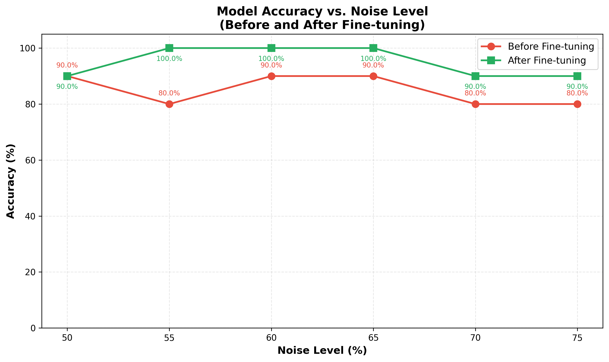
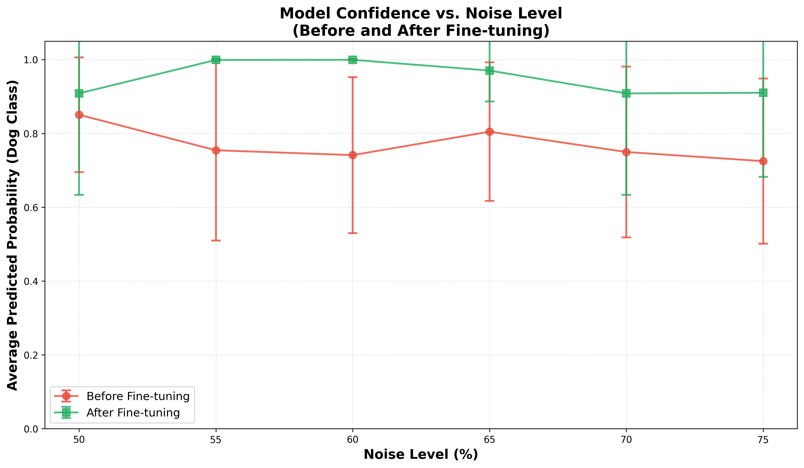

# Noisy vs. clean Dog Image Classification Using Deep Learning in Python
**Carter Susi**

**Nov 30, 2025**

**CAP4613**

**Repo**:\
[https://github.com/cartersusi/susi-ml-bonus](https://github.com/cartersusi/susi-ml-bonus)

## Requirements

[**python3 (venv)**](requirements.txt)
```sh
pip install -r requirements.txt
```
***or***\
[**python3 (uv)**](pyproject.toml)
```sh
uv sync
```

---

[**Config**](conf.json)
```json
{
  "model_path": "/[path]/models/cat_dog_cnn_23.pth",
  "cat_dog_images": "/[path]/kagglehub/datasets/karakaggle/kaggle-cat-vs-dog-dataset/PetImages",
  "dog_noise_images": "/[path]/Dog_Noise"
}
```

---

[**Params**](main.py)
```py
parser.add_argument("--d", action="store_true") # Download Dataset
parser.add_argument("--t", action="store_true") # Train Model
parser.add_argument("--f", action="store_true") # Finetune Model
```

---


[Kaggle: Cat Vs Dog Dataset](https://www.kaggle.com/datasets/karakaggle/kaggle-cat-vs-dog-dataset)

Can be downloaded programatically with a `kaggle.json` at prj root or `~/.kaggle/kaggle.json`.
```sh
python3 main.py --d # Download flag
```

## 1. Intro

### Objective
The objective of this assignment is to test noisy images of dogs on our previous model trained to classify cats and dogs.\
Using **20 images** of dogs with noise added in intervals of 5, we will:
1. [eval](test.py) - `pre-finetune`
2. [finetune](finetune.py)
3. [eval](test.py) - `post-finetune`

### Dataset
Using the [Kaggle: Cat Vs Dog Dataset](https://www.kaggle.com/datasets/karakaggle/kaggle-cat-vs-dog-dataset).

The [model](./models/cat_dog_cnn_23.pth) is a CNN trained on `12,470` dog images. All of these images have no added noise. 

Since our sample size is small (20 images * 6 intervals), I used **20 images for training** and **20 images for validation** differentuated by the prefix `train_` and `val_`. Each noisey dog image follows the filename structure:
- `[train | val]_[img_name]_[noise_level].jpg`

## 2. Methodology

### CNN Architecture

```py
summary()
```
```
==========================================================================================
Layer (type:depth-idx)                   Output Shape              Param #
==========================================================================================
CatDogCNN                                [1, 2]                    --
├─Sequential: 1-1                        [1, 64, 75, 75]           --
│    └─Conv2d: 2-1                       [1, 64, 150, 150]         1,792
│    └─ReLU: 2-2                         [1, 64, 150, 150]         --
│    └─BatchNorm2d: 2-3                  [1, 64, 150, 150]         128
│    └─MaxPool2d: 2-4                    [1, 64, 75, 75]           --
├─Sequential: 1-2                        [1, 512, 37, 37]          --
│    └─Conv2d: 2-5                       [1, 512, 75, 75]          295,424
│    └─ReLU: 2-6                         [1, 512, 75, 75]          --
│    └─BatchNorm2d: 2-7                  [1, 512, 75, 75]          1,024
│    └─MaxPool2d: 2-8                    [1, 512, 37, 37]          --
├─Sequential: 1-3                        [1, 512, 18, 18]          --
│    └─Conv2d: 2-9                       [1, 512, 37, 37]          2,359,808
│    └─ReLU: 2-10                        [1, 512, 37, 37]          --
│    └─BatchNorm2d: 2-11                 [1, 512, 37, 37]          1,024
│    └─MaxPool2d: 2-12                   [1, 512, 18, 18]          --
├─Sequential: 1-4                        [1, 512, 9, 9]            (recursive)
│    └─Conv2d: 2-13                      [1, 512, 18, 18]          (recursive)
│    └─ReLU: 2-14                        [1, 512, 18, 18]          --
│    └─BatchNorm2d: 2-15                 [1, 512, 18, 18]          (recursive)
│    └─MaxPool2d: 2-16                   [1, 512, 9, 9]            --
├─Sequential: 1-5                        [1, 512, 4, 4]            (recursive)
│    └─Conv2d: 2-17                      [1, 512, 9, 9]            (recursive)
│    └─ReLU: 2-18                        [1, 512, 9, 9]            --
│    └─BatchNorm2d: 2-19                 [1, 512, 9, 9]            (recursive)
│    └─MaxPool2d: 2-20                   [1, 512, 4, 4]            --
├─Sequential: 1-6                        [1, 512, 2, 2]            (recursive)
│    └─Conv2d: 2-21                      [1, 512, 4, 4]            (recursive)
│    └─ReLU: 2-22                        [1, 512, 4, 4]            --
│    └─BatchNorm2d: 2-23                 [1, 512, 4, 4]            (recursive)
│    └─MaxPool2d: 2-24                   [1, 512, 2, 2]            --
├─Sequential: 1-7                        [1, 2]                    --
│    └─Flatten: 2-25                     [1, 2048]                 --
│    └─Linear: 2-26                      [1, 2]                    4,098
==========================================================================================
Total params: 2,663,298
Trainable params: 2,663,298
Non-trainable params: 0
==========================================================================================
```

### Data Processing
The dataset is split into:
- **50%** train (20 dog images)
  - 150x150px with added noise in intervals of 5, e.g. {0, 5, 10, ..., 95, 100}
- **50%** test (20 dog images)
  - 150x150px with added noise in intervals of 5, e.g. {0, 5, 10, ..., 95, 100}
  
### Hyperparameters
The model is trained using the following configuration:
- **Batch size**: 32 samples per batch
- **Learning rate**: 0.0001
- **Optimizer**: Adam optimizer with default parameters
- **Loss function**: Cross-entropy loss
- **Training epochs**: 10
- **Random seed**: 42

## Results
For context, per project requirements the sample size is only 20 dog images at 6 noise levels.

### Accuracy vs. Noise Level Curve (Main Summary Plot)


The plot shows consistent improvment with no noise level seeing a regression, with either a 10-20% increase in accuracy or no gain at all.

### Per-Image Robustness Curve

| Before | After |
| - | - |
|  |  |

The plot shows the average trend near 1.0 at mid-noise levels, indicating the model learned generalizable noise-invariant features rather than memorizing specific examples.

### Confusion Matrix per Noise Level

| Before | After |
| - | - |
|  |  |

The elimination of false positives at 55-65% noise levels demonstrates that finetuning specifically addressed the model's tendency to predict cat features in noisy images. The single misclassification at 50%, 70%, and 75% noise suggests there are still specific images that remain challenging even after finetuning.

### Probability Confidence vs. Noise Level


The sustained confidence of ~0.90-1.00 even at 75% noise shows the finetuned model learned to extract discriminative features from severely degraded inputs rather than simply guessing.

### Error Rate Distribution

| Before | After |
| - | - |
|  |  |

The bimodal nature of the before distributions suggests the baseline model made binary choices without nuance, while after finetuning the few errors at high noise levels appear as isolated failures rather than systemic.

### Example Visualization of Noisy Images


The second and third dog images remain correctly classified with high confidence even at 70-75% noise where human recognition would struggle, yet both fail at these extreme levels. 
This suggests the model learned to focus on structural features that persist through noise rather than relying on texture or fine details that degrade quickly.
